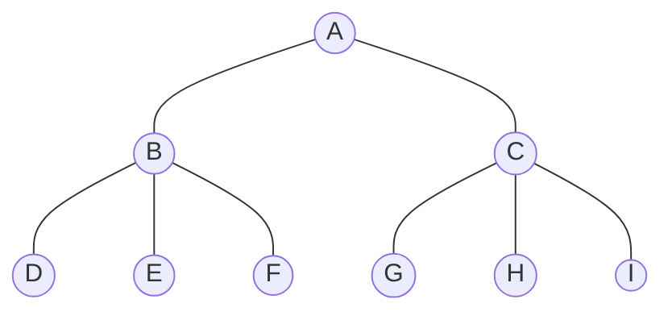

### 一、数据结构和算法


#### 1. 数据结构

​	数据结构是**计算机存储、组织数据**的方式。数据结构是指相互之间存在一种或多种特定关系的**数据元素**的集合。通常情况下，选择正确的数据结构可以带来更高的运行效率和存储效率。数据结构往往同高效的检索算法和索引技术有关。

​	数据结构演示地址：https://www.cs.usfca.edu/~galles/visualization/Algorithms.html

​	常见的数据结构如下：线性数据结构（数组、队列、链表、栈等）、非线性数据结构（）


##### 1.1 线性数据结构

###### 1.1.1 数组（Array）

​	数组（Array）是一种线性表数据结构，它用于存储具有固定大小的相同类型的数据元素。在数组中，数据元素按照有序的方式进行排列，可以通过索引访问任意位置的元素。

```java
// Java中创建数组的方式
// 动态初始化，初始化时程序员指定长度。由系统为数组分配初始值。
char c1[] = new char[5];
// 静态初始化，初始化时程序员指定默认值。由系统指定长度。
char c2[] = new char[]{'a','b','c'};
char c3[] = {'a','b','c'};
```

数组的特点：
1. **顺序存储**：数组中的元素按照顺序存储在连续的内存空间中，每个元素都有一个唯一索引，可以通过索引快速访问。
1. **大小固定**：一旦定义了数组的大小，就不能改变。如果需要更大的数组，则需要重新创建数组。
1. **元素类型相同**：数组中的所有元素必须是相同的数据类型。
1. **无界数组**：数组的长度可以是任意正整数，只要内存空间足够。

数组的优点：

1. **易于实现**
2. **访问速度快**：因为数组是**顺序存储**，可以通过索引快速访问数组中的元素。时间复杂度为**O(1)**。

数组的缺点：

1. **大小固定**：数组的大小是固定的，如果需要更多的数组空间，则需要重新创建数组，这样会带来额外的开销。
2. **空间利用率低**：因为数组中的元素是**按照顺序存储在连续的内存空间中**。所以在数组中，即便某些内存空间未被使用，也不能被其他数据结构使用。导致空间利用率较低。

###### 1.1.2 队列（Queue）

​	队列（Queue）是一种特殊的数据结构，其特点是遵循先进先出（FIFO）的原则。队列中的元素只能从一端（队尾）添加，从另一端（队头）删除。

```java
// Java中创建队列的方式之一
public static void main(String[] args){
    Queue<String> queue = new LinkedList();
    queue.offer("3");
    queue.offer("6");
    queue.offer("9");
    queue.offer("12");
    System.out.println(queue);// 打印队列中的所有元素
    System.out.println(queue.peek());// 访问队列头元素
    System.out.println(queue);// 打印队列中的所有元素
    System.out.println(queue.poll());// 访问队列尾元素
    System.out.println(queue);// 打印队列中的所有元素
}
```

队列的特点：

1. 先进先出：队列中的元素遵循先进先出（FIFO）的原则。即最早进入队列的元素最先被删除。
2. **一端进，一端出**：队列有两个主要的操作端点，分别称为队尾（rear）和队头（front）。新元素从队尾加入队列，而已有元素则从队头被移除。这种设计保证了队列操作的顺序性和高效性。
3. 无界队列：队列的长度可以是任意正整数，只要内存空间足够。

###### 1.1.3 链表（Linked）

​	链表（Linked）是一种常见的线性数据结构，它通过指针将一组零散的内存块串联在一起，链表中每个内存块都被称为节点，每个节点除了存储数据之外，还需要记录下一个节点的地址。

链表的特点：

1. 不需要连续的内存空间
2. 有指针引用
3. 插入、删除效率高，时间复杂度为O(1)，仅需要修改指针的地址即可。但是，随机访问效率低，时间复杂度为O(n)。需要从链头至链尾进行遍历。

链表包括单向链表、双向链表和循环链表等类型。其中，单向链表只有一个后继指针next指向下一个节点。双向链表的节点除了有一个后继指针指向下一个节点，还有一个前驱指针指向前面的节点。循环链表和单向链表唯一的区别是尾节点的指针指向头节点，形成一个环。

###### 1.1.4 栈（Stack）

​	栈（Stack）是一种后进先出（LIFO）的数据结构，它只能在一端进行插入和删除。这一端称为栈顶，另一端称为栈底。栈的元素之间存在一种顺序关系，这种顺序关系由元素的插入和删除操作而决定。

栈的特点：

1. 后进先出（LIFO）
1. 无界队列：长度可以是任意正整数，只要内存空间足够。


##### 1.2 非线性数据结构

​	在非线性数据结构中，数据之间并不是简单的前后关系。非线性结构是一种相对复杂的数据结构，它不满足线性结构的数据元素之间的一对一关系，而是满足多对多的关系（这种关系可以通过指针、引用等方式来实现），它可以用来表示复杂的数据关系，如：网络关系、图形关系等

​	非线性结构包括：图结构、数结构、二维数组、广义表、多位数组等。

###### 1.2.1 树（Tree）

​	树是n个结点的有限集合，当n=0时，我们称之为空树。在树中需要注意的是，根结点有且仅有一个，其下的子树没有个数限制，但他们一定是互不相交的。所以，任意一个非空树都具有一下特点：

1. 有且仅有一个特定的根节点[root]
2. 当n>1时，其余的结点可分为m(m>0)个互不相交的有限集。其中每个集合本身又是一棵树，我们称之为子树。

如图，是一颗普通的树：




